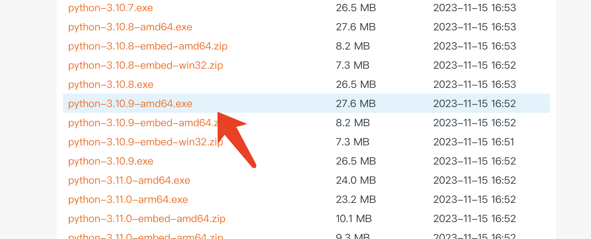
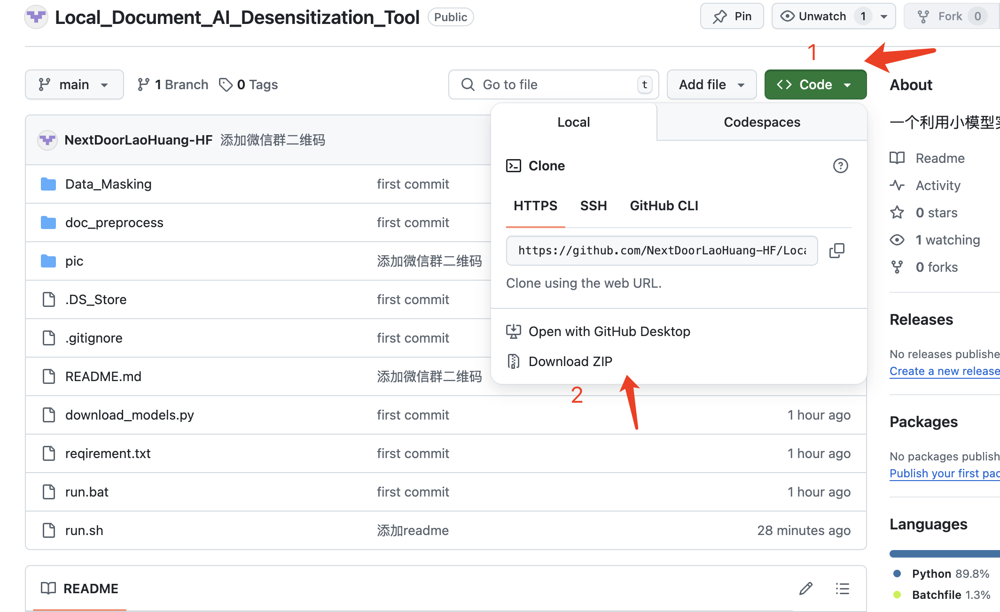
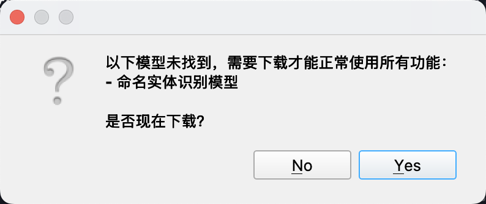
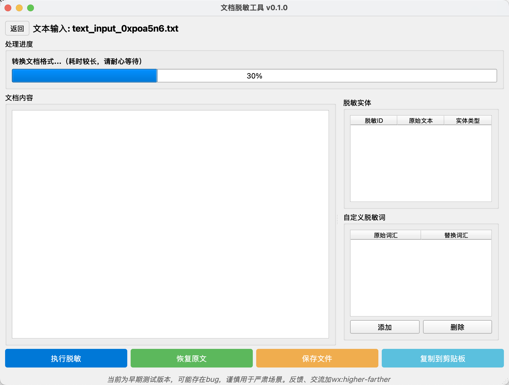
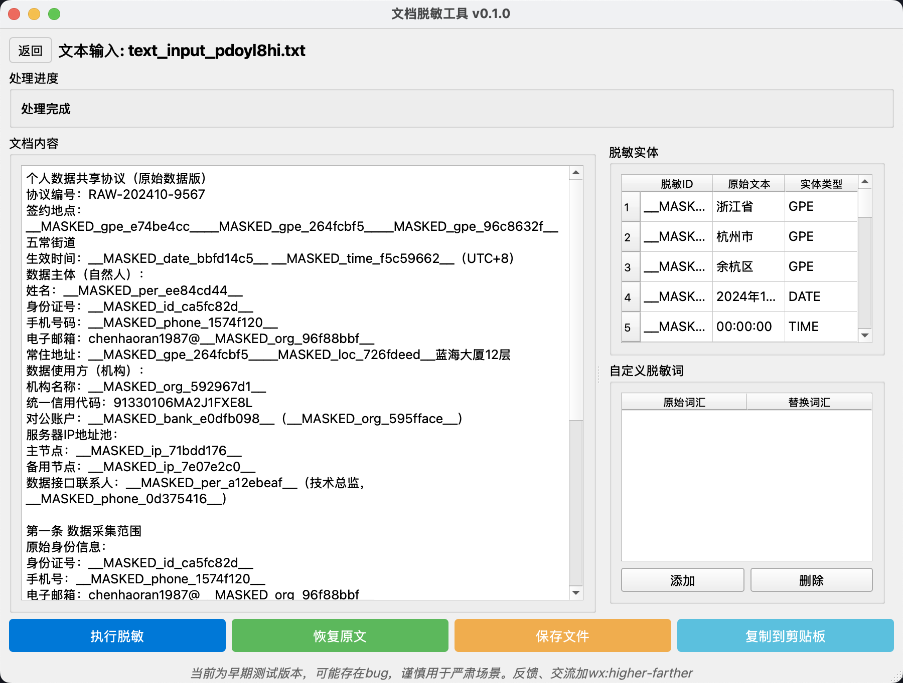
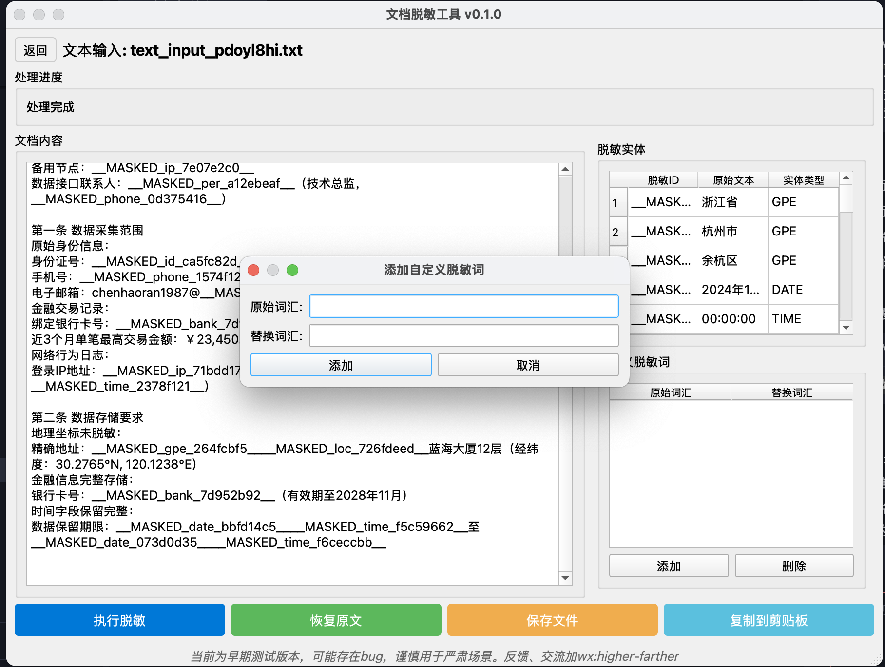

# 【开源工具】本地智能脱敏，让在线AI处理敏感文档更安心

## 前言

专业人士们（尤其法律领域）希望利用在线AI提升效率，但对敏感文档的数据安全感到担忧。而本地大型模型部署目前在成本和体验上尚有不足。

为此，我们开发并开源了这款**本地文档脱敏工具**。它旨在文档**离开您电脑前**完成敏感信息处理，让您能更放心地使用云端AI。

**核心流程**：本地导入 -> 智能脱敏 -> 安全发送至在线AI -> 获取结果 -> 本地一键还原。

## 主要功能

*   **多种格式输入**：支持 PDF (含扫描件)、DOCX、DOC，并转换为适合AI处理的 Markdown。
*   **智能脱敏**：结合轻量AI与规则，自动识别并替换人名、地名、机构、联系方式、证件号等敏感信息为 `__MASKED_{type}_{uuid}__` 占位符。
*   **灵活定制**：支持添加自定义敏感词及指定替换值。
*   **脱敏一致性**：同一敏感信息在不同文档中会被替换为相同的占位符，方便处理关联文档。
*   **一键还原**：将在在线AI处理后的文本粘贴回来，即可快速恢复原始信息。

## 重要提示

*   **首次运行**：需联网下载本地AI模型 (约 5.2GB)，请耐心等待（进度条可能在10%停留较久）。
*   **处理速度**：直接处理文档可能耗时较长（尤其转换Markdown时）。如需快速脱敏部分内容，**建议直接粘贴文本**到输入框。
*   **硬件建议**：推荐在 **8GB 内存及以上**的电脑运行。
*   **版本说明**：当前为**早期测试版**，可能存在Bug，请谨慎用于严肃场景。欢迎反馈！

## 安装与使用

### 1. 环境准备
- **Python 3.10+** 安装：
  - 国内用户推荐从 [阿里云镜像站](https://mirrors.aliyun.com/python-release/windows/) 下载
  
  - 一般较新电脑选择 `python-3.10.9-amd64.exe` 即可
  - 安装时，**务必勾选** "Add Python to PATH"

### 2. 获取工具
- 从 [GitHub 仓库](https://github.com/NextDoorLaoHuang-HF/Local_Document_AI_Desensitization_Tool/tree/main) 下载

- 下载完成后在本地选择合适位置解压

### 3. 运行工具
- **Windows用户**：双击 `run.bat`
- **首次运行**：
  - 会自动下载必要依赖
  - 会提示下载模型 (约5.2GB)
  
  - 点击"yes"开始下载
  - 注意：下载进度可能在10%停留较久，属正常现象

### 4. 使用说明
#### 主界面

- 默认使用"文件上传"方式
- 可切换为"文本输入"直接粘贴文本

#### 处理过程

- 文件上传方式会在30%停留较长时间（Markdown转换）
- 脱敏完成后：
  
  - 可一键复制到剪贴板
  - 可保存为文件

#### 自定义敏感词

1. 点击右下"添加"按钮
2. 输入自定义敏感词及替换值
3. 点击"追加"
4. 点击"执行脱敏"

### 5. 额外依赖
- 如需处理 `.docx`/`.doc` 文件，**必须**预先安装：
  - [LibreOffice(Windows版)](https://mirrors.cloud.tencent.com/libreoffice/libreoffice/stable/)

## 结语

这款开源工具希望能为关注数据安全又希望拥抱AI的您提供一个实用选择。我们期待您的试用与宝贵反馈，共同完善它！
反馈、共创微信群：
